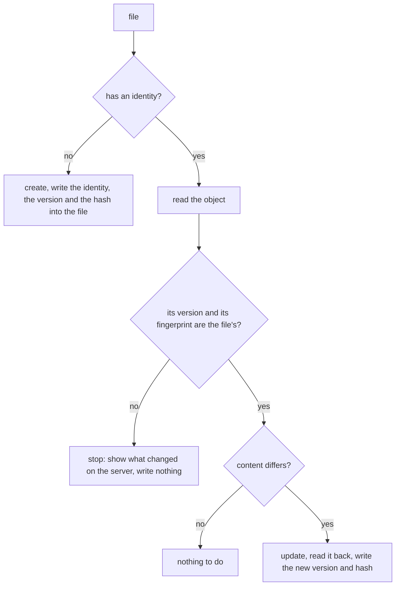

# Files in git: one `pull` / `diff` / `push` for every service

A design that is being built. It records what the owner decided
([#212](https://github.com/bim-ba/ycli/issues/212), [#300](https://github.com/bim-ba/ycli/issues/300),
[#485](https://github.com/bim-ba/ycli/issues/485), [#488](https://github.com/bim-ba/ycli/issues/488),
[#492](https://github.com/bim-ba/ycli/issues/492), [#493](https://github.com/bim-ba/ycli/issues/493)),
says what is built and what is not, and lists the work that is left.

## What it is for

People want the content of Yandex 360 as files in a git repository: Wiki pages as Markdown, the
automation of a Tracker queue as YAML, later forms, grids and dashboards. One mechanism serves every
service, and it lives in the core: a service does not write a `pull` and a `push` of its own. A
resource declares itself a kind of file, and the engine does the rest; a new service is picked
up by the declarations its resources carry.

## Decided

| # | Decision | Choice | Where |
|---|---|---|---|
| 1 | Where the link between a file and its object lives | In the file itself: a Markdown header or YAML keys. No state file | #212 |
| 2 | Commands | `ycli sync pull`, `diff`, `push`: one top-level group for every service | #212 |
| 3 | The server changed after `pull` | `push` stops for that file and shows the difference | #212 |
| 4 | Deletion | A file deleted locally deletes nothing on the server without `--prune` | #212 |
| 5 | Format | Markdown with a header for text, YAML for settings, CSV for tables | #212 |
| 6 | Layout | Directories repeat the service and the container; a run is limited by a path | #212 |
| 7 | First kinds | The Wiki page tree and the triggers of a Tracker queue | #212, #300 |
| 8 | A page file moved locally | `push` stops and explains; it does not move pages | #300 |
| 9 | `push` and local files | `push` writes the identity, the version and the fingerprint into the file | #300 |
| 10 | What `--prune` deletes | What git says was deleted: the files removed since a given commit | #300 |
| 11 | `pull` and a local edit | `pull` always overwrites; git is the protection | #300 |
| 12 | One file fails | `--on-error fail` (the default) goes on and exits non-zero, `--on-error abort` stops at once | #300 |
| 13 | The content of a file | The model of the request that changes the object, as the service already has it: no model is written for a file | #485 |
| 14 | A kind in the code | An object found in a registry when a file is read, not a string looked up each time | #485 |
| 15 | The version key | The kind names it by the service's own word (`revision`, `version`) | #485 |
| 16 | An object with no version | Every file carries `hash`, the fingerprint of its content, always; the server's version is a separate key where the service has one. Both are checked | #485 |
| 17 | How a write proves its version | A class per way, not a flag | #485 |
| 18 | Where a kind is declared | In its resource, beside the client | #485 |
| 19 | Surfaces | CLI, SDK and MCP | #485 |
| 20 | How a resource becomes a kind | One declaration in the resource that names its operations, and marks on those operations | #488 |
| 20a | Where the marks stand | On the functions of `endpoints.py`, the one place an operation is described; the declaration names those functions | #493 |
| 21 | An object with no `id` | No key is invented: the identity is what the read operation is addressed by, which is none, one or several marked arguments | #488 |
| 22 | An operation the API lacks | It is absent from the declaration; the engine says so aloud. No stub that does nothing | #488 |
| 23 | Where the file of an object lies | A field marked `Place()` says it (the `slug` of a page); for a kind with none the path is its container and its identity, under the names of their resources | #493 |
| 23a | Whether a kind may be written | No mark and no field says it. After every write the engine reads the object again and compares what was sent with what was saved; a loss is a loud refusal. A kind known to lose data names no `update` | #493 |
| 24 | The MCP tools of `sync` | Always served, beside `status_get` and `schema_get`; not served by a server reached over HTTP, which has no working directory of the caller | #493, #485 |
| 25 | DataLens in files | A file per entry, not the export of a whole workbook | #484 |

Two rules bound the engine.

- [ARCH-9](../../ARCHITECTURE.md): it does not check what a file means. It refuses a file it cannot
  read as a file of a known kind, sends everything else as it is, and shows the API's answer as it
  is.
- [ARCH-2](../../ARCHITECTURE.md): it imports no service. A resource imports the engine to declare
  itself; an import-linter contract holds the direction.


## Commands

```console
$ ycli sync kinds                   # what can be kept as files: each kind in one line of its own words
$ ycli sync pull wiki/team          # server -> files, under this path
$ ycli sync status                  # which files were edited since pull; no network
$ ycli sync diff                    # what push would change; sends nothing that writes
$ ycli sync push                    # files -> server
$ ycli sync push --prune main       # also delete the objects whose files were deleted since `main`
$ ycli sync validate wiki/          # every file reads as a file of its kind; no network
```

A path argument limits a run to a file or a directory; with none, the run covers the working
directory. `--kind wiki/page`, which may be repeated, limits a run to kinds without knowing the
layout. The global options work as everywhere: `--dry-run` prints the requests `push` would send,
`--yes` answers the questions of `--prune`, `--profile` picks the credentials.

What every command prints ([#492](https://github.com/bim-ba/ycli/issues/492)):

| What | How |
|---|---|
| A summary line last | `2 to create, 1 to update, 1 conflict, 14 unchanged` |
| Unchanged files | hidden; `--show-unchanged` lists them |
| `-o json` | one object a line (`{"path": …, "kind": …, "action": "update"}`), the summary last |
| `-o paths` | the paths touched, one a line: `ycli sync push -o paths \| xargs git add` |
| A secret in `diff` | masked (`password: ***`); `--show-secrets` prints it |
| Under GitHub Actions | a failure of `push` is an annotation on its file; the plan is a table in the job summary |

Exit codes are those of every ycli command, `0` to `6`, and two of `sync`'s own in the same
table: `7`, there are changes, given only when `--exit-code` asks for it (`status` and `diff` exit
with `0` without the flag); `8`, a file stopped because its object changed on the server.

`pull --dry-run` names the files it would overwrite that hold uncommitted work: `pull` overwrites
them, and git is the only protection.

## A file

A file of a kind is the body of the request that changes its object, with a few keys of ycli's own
first.

```markdown
---
ycli: wiki/page
id: 4821
revision: 9917
hash: 9f2c…
title: Onboarding
---
# First day

Ask for access to the queue DE.
```

```yaml
ycli: tracker/trigger
id: 16
version: 3
hash: 41be…
name: Assign on create
active: true
conditions:
- type: Event.create
actions:
- type: Transition
  status:
    key: inProgress
```

| Key | What it is | Who writes it |
|---|---|---|
| `ycli` | the name of the kind | ycli |
| the identity (`id`; several keys for an object addressed by several arguments; none for the only object of its container) | which object the file stands for; absent in a file written for an object that does not exist yet | ycli |
| the version, under the service's word (`revision`, `version`) | the version the content was read at; absent where the service has none | ycli |
| `hash` | the fingerprint of the content as it was read from the server | ycli |
| every other key, and the text under a Markdown header | the content: the fields of the request that changes the object | a person |

The content is dumped the one way a request body is, so a `null` the API requires stays in the
file and a field with no value is left out. What the request cannot carry is not in the file:
timestamps, authors, computed values belong to the server. A field that is not in the file is not
in the request either, so `push` never resets what the file did not show.

A kind whose content model holds a secret is not registered, because its file would hold the
secret; the check over the registry refuses it, and only a decision of the owner lifts that.

## A kind

A resource declares a kind in a module `sync.py` beside its client; nothing lists the kinds, they
are found by walking the packages of the registered services.

```python
# src/ycli/yandex/tracker/triggers/sync.py
class TriggerLink(Link):
    id: int | None = Field(default=None, description="Id of the trigger.")
    version: int | None = Field(default=None, description="Version it was read at.")


TRIGGER = Kind(
    name="tracker/trigger",
    layout=YAMLFile(),
    link=TriggerLink,
    content=TriggerUpdate,
    find=endpoints.list_,
    read=endpoints.get,
    create=endpoints.create,
    update=endpoints.update,
    version=SentVersion(),
)
```

An operation is a function of the resource's `endpoints.py`. Where a kind always gives an
argument a value, the declaration sets it with `functools.partial`, which a type checker reads
like any call:

```python
# src/ycli/yandex/wiki/pages/sync.py
read=partial(endpoints.get_by_id, fields="content"),
find=partial(endpoints.descendants_list, include_self=True),
update=endpoints.update,
```

An argument that nobody names and that may be `None` goes out as `None`, as a field of a body
that is not named is not sent. An argument that must have a value and that nobody names makes
the declaration unusable, and the check over the registry refuses it.

| A declaration states | Trigger | Wiki page |
|---|---|---|
| `name`, written in every file | `tracker/trigger` | `wiki/page` |
| `layout`, a class that reads and writes the file | `YAMLFile()` | `MarkdownWithHeader()` |
| `link`, the keys ycli owns | `id`, `version` | `id`, `revision` |
| `content`, the model of the request that changes the object | `TriggerUpdate` | `PageUpdate`, whose `content` is marked `Body()` |
| the operations it has | `find`, `read`, `create`, `update`; no `delete` | all five |
| `version`, how a write proves the version | `SentVersion()` | `CheckedVersion(newest=…)` |

Marks on the arguments of the operations say the rest, so the declaration does not repeat it.

| Mark | On | Says |
|---|---|---|
| `Identity()` | an argument of an operation | which object it is |
| `Container(queues)` | an argument of an operation | where the object lies: the queue of a trigger. It names the resource that holds the object by its package, so the path takes `queues` from it |
| `Version()` | an argument of a write | the version the write worked from |
| `Body()` | a field of the content model | the text under a Markdown header |
| `Place()` | a field of the reply and of the body of a create | where the file of the object lies (the `slug` of a page) |

The body of a write needs no mark: it is the argument whose type is a model. The link model of a
kind carries the same marks on its fields (`id: Annotated[int | None, Identity()]`,
`revision: Annotated[int | None, Version()]`): a field of the link takes its value from the
field of the reply that has its name, and gives it to the argument that has its mark.

A kind keeps only the objects it is a file of: `only=lambda page: page.page_type in {…}` in
its declaration. An object that was found and that the kind does not keep is named by `pull` as
skipped and counted apart.

Removal condition for the declaration: if a third kind needs a branch on its name inside the
engine, the declaration did not hold, and each service gets plain functions per command instead.

### How a write is guarded

Every file carries `hash`, so every kind has one check that needs no server and no version:

| Check | When | What it tells |
|---|---|---|
| the fingerprint of the file's content against its `hash` | `status`, with no network | the file was edited since `pull` |
| the fingerprint of the object as read now against the file's `hash` | `diff`, `push` | the object changed on the server since `pull` |

A fingerprint is taken from the object as the server returns it, read through the content model.
A service does not always return what it took, so after a write `push` reads the object again and
writes the fingerprint of what it read.

Where the service has a version, a second check stands beside the first:

| `version` | What happens | Atomic | Kinds |
|---|---|---|---|
| `SentVersion()` | the write carries the version from the file; the server refuses a stale one | yes | Tracker objects that take `?version=`, a DataLens dataset |
| `CheckedVersion(newest=…)` | `push` reads the newest version and compares it with the file's | no: an edit landing between the read and the write is overwritten | Wiki pages; DataLens charts, dashboards and reports |
| `NoVersion()`, the default | the fingerprint alone | no | objects whose service has no version: seven resources in ten |

Each way is a class that answers for itself; the engine calls the same thing on any of them and
does not know how many there are.

On a mismatch `push` writes nothing for that file, prints the difference between what the file was
read from and the server's current state, and the run exits with `3`.

Measured, not assumed (recorded in #300 and #484):

| Object | A write from a stale version | A write with no version |
|---|---|---|
| Tracker component (`?version=`) | `412 Precondition Failed` | `428 Precondition Required` |
| Wiki page | `200`, the text is overwritten; a `revision_id` in the body is ignored | the same |
| Wiki grid (`revision` in the body) | `409 CELL_UPDATE_CONFLICT` for a cell changed after that revision; `200` for a title, columns, rows | n/a |
| Forms survey | `200`: the API has no version | the same |
| DataLens dataset | `400 ERR.DS_API.DATASET_REVISION_MISMATCH` | n/a |
| DataLens chart, dashboard, report | `200`, overwritten, also with the `revId` of another entry | `200` |

### What a write loses

A service does not always keep what it took: a DataLens report takes a body, answers `200`, and
comes back without the layout of its slides. So `push` does not trust a write. One file goes
through six steps:

1. read the object;
2. compare its version and its fingerprint with the file's, and stop on a mismatch;
3. write;
4. read the object again;
5. compare what was sent with what was saved;
6. write the new version and fingerprint into the file.

When step 5 finds a difference, `push` says so aloud, lists the paths that were lost inside the
object, and the run exits non-zero. Nothing marks a kind as safe to write, and there is no list of
kinds that are: the check runs on every write of every kind.

A working rule beside it, kept by a test and not by a mechanism: a kind names `update` in its
declaration after a live round trip has shown that the service keeps what it takes. A kind known
to lose a part of itself names no `update`, and the docstring of its module says why.

### What each command does to one file



| File | Server | `pull` | `diff` | `push` |
|---|---|---|---|---|
| absent | object exists | writes the file | "no file" | nothing |
| deleted since the commit `--prune` names | object exists | writes the file again | "would delete" | with `--prune` asks, then deletes |
| has no identity | no such object | nothing | "would create" | creates, writes the link into the file |
| unchanged | unchanged | nothing | nothing | nothing |
| edited | unchanged | overwrites the file | the difference | updates, writes the new link |
| any | changed since `pull` | overwrites the file | "changed on the server" and the difference | stops, writes nothing |
| has an identity | object is gone | reports it, keeps the file | "gone on the server" | stops for that file |
| asks for an operation the API lacks | | | says which | says which, counts the file as failed |

Two consequences of keeping the link in the file:

- `push` edits local files: a created object gets its identity, and every write changes the
  version and the fingerprint. A commit follows a push.
- There is no record of what was pulled apart from the files themselves, so `--prune` takes it
  from git: `push --prune <commit>` reads the files deleted since that commit
  (`git diff --diff-filter=D <commit>`), takes the identity each one held at that commit, and asks
  about each object before deleting it; `--yes` answers for all of them. Outside a git repository
  `--prune` is refused. An object that never had a file is never a candidate.

A known price: `pull` lists a container and then reads every object in it with one request
each, even where the listing already answers the whole object (a trigger). One path for every
kind is worth more than the requests; a kind may say its listing is enough when a container
grows too large to read this way.

### What the engine does and does not check

| The engine refuses | The engine sends as it is |
|---|---|
| a file whose header or YAML does not parse, with its path and line | any value of any content field |
| a file whose `ycli` names no known kind | a field the API may reject |
| a key the content model of the kind does not have | an object the API may refuse to create |
| a path that does not fit the kind's layout | |

An error of the API is printed with the file's path; `--on-error` decides whether the run goes on.

## The two first kinds

### A Wiki page

| In the file | From the API | Sent by `push` |
|---|---|---|
| path `wiki/team/onboarding.md` | `slug` = `team/onboarding` | on create only (`POST /pages`) |
| `id` | `id` | in the address |
| `revision` | the newest item of `GET /pages/{id}/revisions` | no: the API takes none |
| the keys of the header | the fields of `PageUpdate`: `title`, and `redirect`, `actuality`, `access_policy`, `owner` when given | yes |
| the text under the header | `content` | yes |

A page and its children sit side by side: `wiki/team/onboarding.md` and the directory
`wiki/team/onboarding/` with the pages under it. `pull wiki/team` lists the descendants of `team`
and writes one file per page whose `page_type` is `page` or `wysiwyg` (a page created through the
API with no type is a `wysiwyg` one); every other type is named and skipped
([#316](https://github.com/bim-ba/ycli/issues/316)). A file moved or renamed locally makes `push`
stop and explain: the header holds the `id`, the path names another `slug`, and `push` moves no
page. Attachments are not synchronized ([#315](https://github.com/bim-ba/ycli/issues/315)).

### A trigger of a Tracker queue

The Tracker API has no operation that changes a queue itself. What can be changed lives inside
the queue, one operation per part, so each part is a kind of its own and the queue is a directory:

```text
tracker/queues/DE/triggers/16.yaml
tracker/queues/DE/components/backend.yaml
tracker/queues/DE/macros/close-as-duplicate.yaml
```

| In the file | From the API | Sent by `push` |
|---|---|---|
| path `tracker/queues/DE/triggers/16.yaml` | the queue and the `id` | in the address |
| `version` | `version` | as `?version=`: the server refuses a stale one |
| `name`, `active`, `conditions`, `actions` | the same fields | yes, as written |

`conditions` and `actions` are written with the API's own keys and sent back untouched: the engine
does not know the action types and does not check them. The API has no operation that deletes a
trigger: for a trigger file deleted with `--prune` the engine says so.

## Built and not built

| Part | State |
|---|---|
| A file as a document: the two layouts, the link, the content, the fingerprint, the refusals (`ycli.yandex.sync.document`, `formats`) | built |
| The declaration of a kind, the marks, the registry, `ycli sync kinds`, one check over every declared kind (`ycli.yandex.sync.kind`, `marks`; `ycli.yandex.registry.kinds`) | built |
| `wiki/page` and `tracker/trigger` declared | built |
| `status`, `validate`, where a file lies (`ycli.yandex.sync.files`, `paths`) | built |
| `pull` (`ycli.yandex.sync.pull`) | built |
| `diff`, `push`, `--on-error`, the exit codes, the output of #492 | not built |
| `--prune` | not built |
| The MCP tools, in one change with `pull` / `diff` / `push` | not built |
| A how-to page in `docs/en` and `docs/ru`, with the recipe "the plan as a comment on a pull request" | not built |

Not planned until asked for: a manifest file listing what to synchronize, a three-way merge, moving
pages from `push`, an external diff tool. Recorded for later: a check on the server before a write
(an optional operation of the declaration, once a second kind has one), a limit on concurrent
requests.

## Kinds by service

Only the two above are designed. Of 198 resources with a write across the services Yandex
publishes, 140 have no version at all, 16 have one the server checks, 6 have one it does not
check, and for 36 it is not known (surveyed in #485); the fingerprint covers all of them.

| Service | Kind | Layout | Notes |
|---|---|---|---|
| Wiki | page | Markdown | above |
| Wiki | grid | CSV for rows, YAML for the structure | the API merges by cell: rows, columns and cells are written by different operations |
| Tracker | trigger | YAML | above; no delete |
| Tracker | component, macro, queue version, local field | YAML | components take `?version=` |
| Tracker | queue | YAML | read only: no update operation |
| Tracker | workflow, issue type, status, resolution, priority, global field | YAML | organization-wide, not under a queue |
| Forms | survey with its questions, hook, subscription, conditions | YAML | no version |
| DataLens | dashboard, chart | YAML | a file per entry; the round trip of a dashboard is byte for byte, the server checks no version |
| DataLens | report | not decided | measured: a save through the API loses the layout of the slides |
| DataLens | HTML page | not decided | measured: a read does not return its HTML |
| DataLens | connection | not decided | its content holds a secret, which a file may not hold |

Issues, comments and answers are data, not configuration: they are out of scope here and belong to
import and export ([#211](https://github.com/bim-ba/ycli/issues/211)).

## How others do it

| Tool | Commands | Where the link lives |
|---|---|---|
| Terraform | `plan`, `apply` | a separate state file |
| `kubectl` | `diff`, `apply` | in the file: `metadata.name` |
| `grafanactl` | `resources pull`, `resources push` | in the file |
| `mark` (Confluence) | one command that sends | in a header of the Markdown file: space, parent, title |

The Terraform provider for Yandex Cloud covers none of Tracker, Wiki or Forms, so nothing ready
could be taken (checked for #212). `grafanactl` is closest to this design: the same pair of
commands, a path that selects a kind and an object, and an `--on-error` choice between stopping
and going on. `mark` identifies a page by its space and title, so two files that want one title
collide and it has to refuse the second; the link here is the identity, which no edit of the
content can change.
