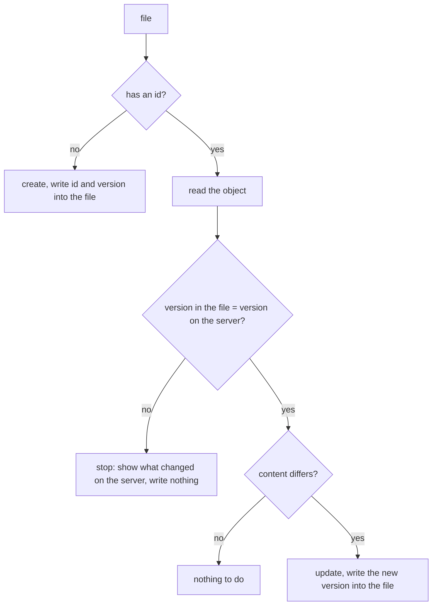

# Files in git: one `pull` / `diff` / `push` for every service

A design, not yet built. It records what the owner decided in
[#212](https://github.com/bim-ba/ycli/issues/212), works two kinds of object through in full, and
lists the work. The questions the two kinds raised were answered in
[#300](https://github.com/bim-ba/ycli/issues/300), one of them by an experiment on the test
organization; the answers are part of the table below.

## What it is for

People want the content of Yandex 360 as files in a git repository: Wiki pages as Markdown, the
automation of a Tracker queue as YAML, later forms, grids and dashboards. One mechanism serves every
service, so a second service does not bring a second, incompatible `pull` and `push`.

## Decided

| # | Decision | Choice |
|---|---|---|
| 1 | Where the link between a file and its object lives | In the file itself: a Markdown header or YAML keys. No state file |
| 2 | Commands | `ycli sync pull`, `ycli sync diff`, `ycli sync push`: one top-level group for every service |
| 3 | The server changed after `pull` | `push` sends the version it worked from; on a mismatch it stops and shows the difference |
| 4 | Deletion | A file deleted locally deletes nothing on the server without `--prune`, which asks about each object |
| 5 | Format | Markdown with a header for text, YAML for settings, CSV for tables |
| 6 | Layout | Directories repeat the service and the container; a run is limited by a path |
| 7 | First work | The engine and two kinds: the Wiki page tree and the settings of a Tracker queue |
| 8 | A Wiki page has no version in its update request | The revision goes into the file's header and `push` checks it before it writes (#300, by experiment) |
| 9 | A Tracker queue cannot be changed through the API | A directory per queue and a file per part; `queue.yaml` is read only, triggers come first |
| 10 | A page file moved locally | `push` stops and explains; it does not move pages |
| 11 | `push` and local files | `push` writes `id` and the new version into the file |
| 12 | What `--prune` deletes | What git says was deleted: the files removed since a given commit |
| 13 | `pull` and a local edit | `pull` always overwrites; git is the protection |
| 14 | One file fails | `--on-error fail` (the default) goes on and exits non-zero, `--on-error abort` stops at once |

One more rule bounds the engine, [ARCH-9](../../ARCHITECTURE.md): it does not check what a file
means. It refuses a file it cannot read as a file of a known kind, sends everything else as it is,
and shows the API's answer as it is.

## Commands

```console
$ ycli sync pull wiki/team          # server -> files, under this path
$ ycli sync diff                    # what push would change; sends nothing that writes
$ ycli sync push                    # files -> server
$ ycli sync push --prune main       # also delete the objects whose files were deleted since `main`
$ ycli sync push --on-error abort   # stop at the first file that fails
```

A path argument limits a run to a file or a directory; with none, the run covers the working
directory. The global options work as everywhere: `--dry-run` prints the requests `push` would
send, `--yes` answers the questions of `--prune`, `--profile` picks the credentials.

`pull` of a path that has no files yet needs to know what to fetch, and the path says it: the
first segment is the service, the rest is the container (`wiki/team` is the Wiki page `team` and
everything under it; `tracker/queues/DE` is the queue `DE`).

## The model: a resource kind

A *kind* is one sort of object that becomes one file: a Wiki page, a queue trigger. The engine
knows nothing about any service; a kind tells it five things.

| A kind states | Wiki page | Queue trigger |
|---|---|---|
| Its name, written in every file | `wiki/page` | `tracker/trigger` |
| Where its files live | `wiki/<slug>.md` | `tracker/queues/<queue>/triggers/<id>.yaml` |
| Its format | Markdown with a header | YAML |
| Its link: what identifies the object and the version it was read at | `id`, `revision` | `id`, `version` |
| Its content: the fields a person edits, which `push` sends | `title`, `content` | `name`, `actions`, `conditions`, `active` |

Everything else the API returns belongs to the server and is not written to the file: timestamps,
authors, `self` links, computed values. A field that is not in the file is not in the request
either, so `push` never resets what it did not show.

### What a kind implements

```python
class Link(BaseModel):
    """What ties a file to its object: written by ycli, never edited by hand."""

    kind: str                      # "wiki/page"
    id: str | None = None          # None: the object does not exist yet
    version: str | None = None     # the version the content was read at


class Document(BaseModel):
    """One file, parsed: its link and its content as the API's own field names."""

    path: PurePosixPath
    link: Link
    content: dict[str, JSONValue]


class Kind(Protocol):
    name: str
    proof: Literal["sent", "checked", "none"]   # how push proves the version, see below

    def find(self, scope: PurePosixPath) -> Iterable[Document]:
        """Every object under `scope` on the server, as the file it becomes."""

    def read(self, link: Link) -> Document:
        """The object as it is on the server now."""

    def read_at(self, link: Link) -> Document | None:
        """The object as it was at `link.version`; None where the API keeps no history."""

    def create(self, document: Document) -> Link: ...
    def update(self, document: Document) -> Link: ...
    def delete(self, link: Link) -> None: ...
```

A kind is written with the SDK clients the service already has (`wiki.pages`, `tracker.triggers`):
it adds no HTTP call of its own. An operation the API does not have is simply absent, and the
engine says so instead of guessing (`tracker/trigger` has no `delete`).

Removal condition for this abstraction: if the third kind needs a branch on its name inside the
engine, the protocol did not hold and each service gets a plain function per command instead.

### How `push` proves it worked from the same version

| `proof` | What happens | Atomic | Kinds |
|---|---|---|---|
| `sent` | The request carries the version from the file; the server refuses a stale one | yes | Tracker objects that take `?version=` |
| `checked` | `push` reads the object first and compares its version with the one in the file | no: an edit landing between the read and the write is overwritten | Wiki pages (the update request has no version field), the title, columns and rows of a Wiki grid (its `revision` guards cells only) |
| `none` | The object has no version; `push` reads it and compares its content with the file's | no | objects whose replies carry no version |

On a mismatch `push` writes nothing for that file and prints the difference between the version
the file was read at and the server's current one. What happens to the other files is the
caller's choice: `--on-error fail`, the default, goes on to the next file and exits non-zero at
the end; `--on-error abort` stops at the first file that fails. An error of the API counts the
same way.

The table comes from an experiment on the test organization (4 October 2026, recorded in #300):

| Object | A write from a stale version | A write with no version |
|---|---|---|
| Tracker component (`?version=`) | `412 Precondition Failed` | `428 Precondition Required` |
| Wiki page | `200`, the text is overwritten; a `revision_id` in the body is ignored and `allow_merge=false` changes nothing | the same |
| Wiki grid (`revision` in the body) | `409 CELL_UPDATE_CONFLICT` for a cell changed after that revision; `200` for a new title, added columns, added and removed rows | n/a |
| Forms survey | `200`: the API has no version | the same |

### What each command does to one file



| File | Server | `pull` | `diff` | `push` |
|---|---|---|---|---|
| absent | object exists | writes the file | "no file" | nothing |
| deleted since the commit `--prune` names | object exists | writes the file again | "would delete" | with `--prune` asks, then deletes |
| has no `id` | no such object | nothing | "would create" | creates, writes `id` and `version` into the file |
| same version, same content | | nothing | nothing | nothing |
| same version, edited | | overwrites the file with the server's content | the difference | updates, writes the new version |
| older version | changed since | overwrites the file | "changed on the server" and the difference | stops, writes nothing |
| has an `id` | object is gone | reports it, keeps the file | "gone on the server" | stops for that file |

`pull` always writes what the server has, over any local edit: the feature is made for a git
repository, and an edit that is not committed is the one thing `git diff` shows before a `pull`.

Two consequences of keeping the link in the file:

- `push` edits local files: a created object gets its `id`, and every successful write changes
  `version`. A commit follows a push.
- There is no record of what was pulled apart from the files themselves, so `--prune` takes it
  from git: `push --prune <commit>` reads the files deleted since that commit
  (`git diff --diff-filter=D <commit>`), takes the `id` each one held at that commit, and asks
  about each object before deleting it; `--yes` answers for all of them. Outside a git
  repository `--prune` is refused. An object that never had a file is never a candidate.

### What the engine does and does not check

| The engine refuses | The engine sends as it is |
|---|---|
| a file whose header or YAML does not parse | any value of any content field |
| a file whose `ycli:` names no known kind | a field the API may reject |
| a path that does not fit the kind's layout | an object the API may refuse to create |

An error of the API is printed with the file's path; `--on-error` decides whether the run goes on.

## Kind 1: a Wiki page

```markdown
---
ycli: wiki/page
id: 4821
revision: 9917
title: Onboarding
---
# First day

Ask for access to the queue DE.
```

| In the file | From the API | Sent by `push` |
|---|---|---|
| path `wiki/team/onboarding.md` | `slug` = `team/onboarding` | on create only (`POST /pages`) |
| `id` | `id` | in the address |
| `revision` | the newest item of `GET /pages/{id}/revisions` | no: the API takes none |
| `title` | `title` | yes |
| the text under the header | `content` | yes |
| not in the file | owner, access, actuality, redirect, attributes, breadcrumbs | never |

A page and its children sit side by side, as decision 6 shows: `wiki/team/onboarding.md` and the
directory `wiki/team/onboarding/` with the pages under it.

`pull wiki/team` lists the descendants of `team` (`GET /pages/descendants`), reads each page with
its content, and writes one file per page whose `page_type` is `page` or `wysiwyg`: both hold
Markdown, and a page created through the API with no type is a `wysiwyg` one. Every other type
is named in the output and skipped ([#316](https://github.com/bim-ba/ycli/issues/316)).

### A full cycle

```console
$ ycli sync pull wiki/team
wiki/team.md                      written (revision 9902)
wiki/team/onboarding.md           written (revision 9917)
wiki/team/roadmap                 skipped: a grid, not a page

$ $EDITOR wiki/team/onboarding.md

$ ycli sync diff
wiki/team/onboarding.md           would update
@@ -1,3 +1,4 @@
 # First day

 Ask for access to the queue DE.
+Read the team rules.

$ ycli sync push
wiki/team/onboarding.md           updated (revision 9917 -> 9940)

$ git commit -am "onboarding: team rules"
```

And when someone edited the page in the browser meanwhile:

```console
$ ycli sync push
wiki/team/onboarding.md: the page changed on the server after pull (revision 9917 -> 9931)
--- pulled (revision 9917)
+++ server (revision 9931)
@@ -1,3 +1,3 @@
 # First day

-Ask for access to the queue DE.
+Ask for access to the queues DE and OPS.
nothing was written; run `ycli sync pull wiki/team/onboarding.md` and repeat your edit
```

Both sides of that difference come from the server (`GET /pages/{id}?revision_id=`), so no copy of
the pulled text has to be kept anywhere.

### What the experiment settled

The page update takes no version, and the server does not refuse a stale write: two updates
sent one after the other, the second without reading the first, both answer `200`. So the proof
for a page is `checked`, with the window the table above states, and nothing on the server
closes it.

### A file moved locally

The path is the page's address, so a moved file names a different address than the page with
its `id` has. `push` stops for that file:

```console
$ ycli sync push wiki/hr/onboarding.md
wiki/hr/onboarding.md: page 4821 lives at team/onboarding, the file is at hr/onboarding
nothing was written; move the page with `ycli wiki pages move`, then `ycli sync pull`
```

### Not in the first version

Attachments of a page: links to them stay as they are in the text
([#315](https://github.com/bim-ba/ycli/issues/315)). The fields listed as "never sent" above.
Page types other than `page` and `wysiwyg` ([#316](https://github.com/bim-ba/ycli/issues/316)).

## Kind 2: the settings of a Tracker queue

The Tracker API has no operation that changes a queue: it publishes `GET`, `POST` (create),
`DELETE` and `_restore`. What can be changed lives inside the queue, one operation per part.

| Part | Create | Update | Delete | Version in the request |
|---|---|---|---|---|
| the queue itself | yes | **no** | yes | n/a |
| triggers | yes | yes | no | yes (`?version=`) |
| autoactions | yes | no | no | n/a |
| components | yes | yes | yes | yes (`?version=`) |
| versions | yes | yes | yes | no |
| macros | yes | yes | yes | no |
| local fields | yes | yes | no | no |
| permissions | n/a | yes (add and remove subjects) | n/a | no |

So "the settings of a queue" is a directory, and each part is a kind of its own:

```text
tracker/queues/DE/queue.yaml              # read only
tracker/queues/DE/triggers/16.yaml
tracker/queues/DE/components/backend.yaml
tracker/queues/DE/macros/close-as-duplicate.yaml
```

`queue.yaml` is written by `pull` and never sent: if it differs from the server, `diff` shows the
difference and `push` says the API cannot change a queue. A `queue.yaml` with no `id` creates the
queue.

### A trigger

```yaml
ycli: tracker/trigger
id: 16
version: 3
name: Assign on create
active: true
conditions:
  - type: Event.create
actions:
  - type: Transition
    status:
      key: inProgress
```

| In the file | From the API | Sent by `push` |
|---|---|---|
| path `tracker/queues/DE/triggers/16.yaml` | `queue.key`, `id` | in the address |
| `id` | `id` | in the address |
| `version` | `version` | as `?version=`: the server refuses a stale one |
| `name`, `active`, `conditions`, `actions` | the same fields | yes, as written |
| not in the file | `self`, `order`, `queue` | never |

`conditions` and `actions` are written with the API's own keys and sent back untouched: the engine
does not know the action types and does not check them (ARCH-9).

### A full cycle

```console
$ ycli sync pull tracker/queues/DE
tracker/queues/DE/queue.yaml              written (version 12, read only)
tracker/queues/DE/triggers/16.yaml        written (version 3)
tracker/queues/DE/triggers/21.yaml        written (version 1)

$ $EDITOR tracker/queues/DE/triggers/16.yaml      # active: false

$ ycli sync diff tracker/queues/DE
tracker/queues/DE/triggers/16.yaml        would update
@@
-active: true
+active: false

$ ycli sync push tracker/queues/DE
tracker/queues/DE/triggers/16.yaml        updated (version 3 -> 4)
```

A new trigger is a new file without `id`; its name is free until `push` creates the trigger and
renames the file to its `id`. A trigger file deleted in git cannot be pruned, the API has no
delete for triggers, and `push --prune` says so.

A stale file is refused by the server itself; ycli then reads the trigger and prints what changed,
as for a page.

## Kinds by service

Only the two worked above are designed. The rest is the list to choose from, with what the
published API allows; each needs its own short design before it is built.

| Service | Kind | Format | Proof | Notes |
|---|---|---|---|---|
| Wiki | page | Markdown | `checked` | worked above |
| Wiki | grid | CSV for rows, YAML for the structure | `sent` for a cell, `checked` for the rest | the API merges: a stale `revision` is refused only for a cell changed after it |
| Tracker | queue | YAML | n/a | read only: no update operation |
| Tracker | trigger | YAML | `sent` | worked above; no delete |
| Tracker | component | YAML | `sent` | |
| Tracker | queue version, macro, local field | YAML | `none` | local fields have no delete |
| Tracker | autoaction | YAML | n/a | create only: no update, no delete |
| Tracker | queue permissions | YAML | `none` | the API adds and removes subjects, it does not replace the list |
| Tracker | workflow, issue type, status, resolution, priority, global field | YAML | `sent` | organization-wide: `tracker/workflows/…`, not under a queue |
| Tracker | board, column, sprint | YAML | not checked yet | sprints take `If-Match` |
| Forms | survey with its questions | YAML | `none` | no version in the published schema |
| Forms | hook, subscription, conditions | YAML | `none` | |
| DataLens, API 360 and the rest | | | | after the service itself is wrapped (#111) |

Issues, comments and answers are data, not configuration: they are out of scope here and belong to
import and export ([#211](https://github.com/bim-ba/ycli/issues/211)).

## Work

The engine, in this order; each item is one pull request with its tests.

1. `Link`, `Document` and the file formats: read and write a Markdown header and a YAML file,
   keeping the link keys first and the content in the API's order. A file that does not parse is
   refused with its path and line.
2. The `Kind` protocol, the registry of kinds, and the mapping between a path and a kind.
3. `ycli sync pull`: walk a scope and write the files, over whatever is there.
4. `ycli sync diff`: the per-file states of the table above, a unified difference of the content.
5. `ycli sync push`: create, update, the three proofs, the stop on a mismatch, writing the link
   back, `--on-error fail|abort`, the exit code.
6. `--prune <commit>`: the files git says were deleted since the commit, a question per object,
   `--yes`, the refusal outside a repository.
7. A how-to page in `docs/en` and `docs/ru`, and the command reference.

The kinds:

8. `wiki/page`: pages of type `page` and `wysiwyg`.
9. `tracker/queue` (read only) and `tracker/trigger`.

Not planned until asked for: a manifest file listing what to synchronize, a three-way merge, moving
pages from `push`. Recorded for later: attachments (#315), the other page types (#316).

## How others do it

| Tool | Commands | Where the link lives |
|---|---|---|
| Terraform | `plan`, `apply` | a separate state file |
| `kubectl` | `diff`, `apply` | in the file: `metadata.name` |
| `grafanactl` | `resources pull`, `resources push` | in the file |
| `mark` (Confluence) | one command that sends | in a header of the Markdown file: space, parent, title |

The Terraform provider for Yandex Cloud covers none of Tracker, Wiki or Forms, so nothing ready
could be taken (checked for #212). `grafanactl` is closest to this design: the same pair of commands, a path that
selects a kind and an object, and an `--on-error` choice between stopping and going on. `mark`
identifies a page by its space and title, so two files that want one title collide and it has to
refuse the second; the link here is the `id`, which no edit of the content can change.
