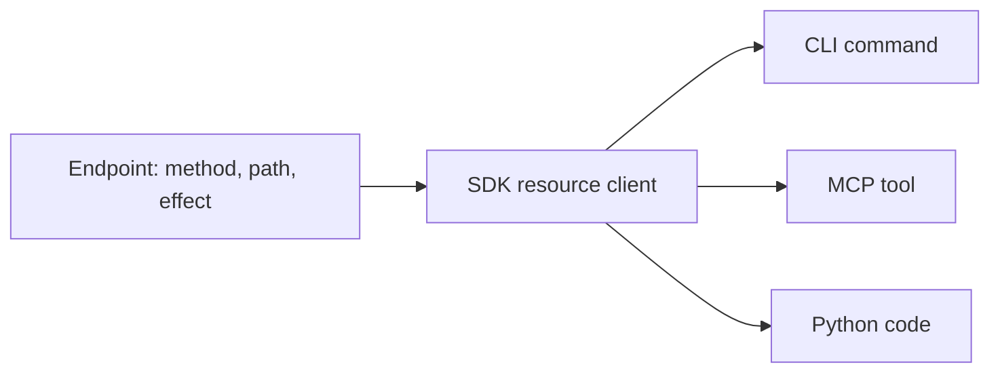

# Design

## One operation, four surfaces

Every Yandex operation ycli wraps is declared once, as an `Endpoint`: its method, path, body,
response type and what it does to the server. The SDK sends it; the CLI command and the MCP tool
call the SDK, so the surfaces cannot disagree about an operation. The CLI command and the MCP tool
share one name: `ycli tracker boards update` is the tool `tracker_boards_update`, and both call
`tracker.boards.edit`. A name learned on one surface works on the other.

## Honest effects

An agent's host decides from the tool hints whether to run a call without asking. The MCP default
for a tool without hints is "destructive", and a hint that says "read" on a delete is worse than
none. In ycli the effect is part of the endpoint (`read`, `write`, `idempotent_write`,
`destructive`), and a contract test runs every tool and compares its hints with the strongest
effect of the requests it actually sent. `--read-only` hides every tool that writes.

## The API's own field names

Output keeps each API's field names: Tracker's `createdAt`, Wiki's `created_at`. A key reads the
same in Yandex's documentation, in `--format json` and in a tool result, so a filter copied from
the docs works. Python code reads snake_case attributes (`issue.created_at`).

## Typed at the edges

Input from a person or an agent becomes a typed model at the boundary: an MCP write body is a
pydantic model, so a malformed value fails before a request is sent, with a message that names
the field. A non-2xx answer becomes a typed error in one place, and the CLI maps each kind to its
own [exit code](../reference/configuration.md#exit-codes).

## The rules are checked

The layout and these rules are invariants with executable checks: surface parity, import layers,
honest effects, one output path, single sources of truth, a versioned public surface, dependency
injection and typed boundaries. They are listed with their checks in
[ARCHITECTURE.md](https://github.com/bim-ba/ycli/blob/main/ARCHITECTURE.md).
