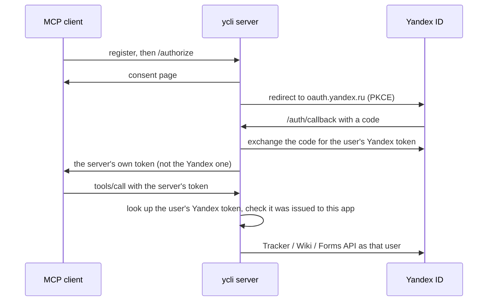

# Self-host the MCP server over HTTP

Web clients (claude.ai, ChatGPT) and teams need the MCP server at an HTTPS address instead of a
local process. `ycli mcp start --transport http` serves it there. Each MCP client signs its
user in through Yandex ID, and every tool call runs with that user's own Yandex token, so
everyone keeps their own Tracker, Wiki and Forms permissions.

There is no public ycli instance: you run your own, with your own Yandex OAuth app.

## How sign-in works

The MCP authorization spec forbids a server to pass a client's token through to another API,
and Yandex ID cannot register MCP clients on the fly. So the server is the OAuth client of Yandex
(fastmcp's `OAuthProxy`):



The client only ever holds the server's token. The server accepts a Yandex token only if Yandex
ID says it was issued to the server's own OAuth app.

## 1. Register a Yandex OAuth app

At [oauth.yandex.ru](https://oauth.yandex.ru), create an app for **user authorization (web
services)**, not one "for API access" (that kind has a fixed redirect URI):

| Field | Value |
|---|---|
| Redirect URI | `<base_url>/auth/callback`, e.g. `https://mcp.example.com/auth/callback` |
| Permissions | Tracker, Wiki and Forms, read and write as you need (Yandex allows at most three permission groups per app) |

Note the client id and the client secret.

## 2. Configure

| Variable | Required | Meaning |
|---|---|---|
| `YCLI__MCP__BASE_URL` | yes | the public HTTPS address clients use, e.g. `https://mcp.example.com` |
| `YANDEX_ID_ORGANIZATION_ID` | yes | the organization every caller works in |
| `YANDEX_OAUTH_CLIENT_ID`, `YANDEX_OAUTH_CLIENT_SECRET` | yes | the app from step 1 |
| `YCLI__MCP__JWT_SIGNING_KEY` | recommended | signs the server's tokens; derived from the client secret when unset, so rotating the secret signs everyone out |
| `YCLI__MCP__HOST`, `YCLI__MCP__PORT` | no | where the process listens (default `127.0.0.1:8000`); `--host` / `--port` override them |
| `YCLI__MCP__TOKEN_CACHE_SECONDS` | no | how long a verified Yandex token is trusted before Yandex ID is asked again (default 300); a revoked token works at most this long |
| `FASTMCP_HOME` | no | where client registrations and tokens are kept, encrypted (default: the user data directory; `/data` in the Docker image); keep it on a volume |

`YANDEX_ID_OAUTH_TOKEN` is not used over HTTP: a call without a signed-in user is refused, never
served with a token from the environment.

## 3. Run

With Docker (the image's `ycli` is the entry point):

```bash
docker run -d --name ycli-mcp -p 127.0.0.1:8000:8000 \
  -e YCLI__MCP__BASE_URL -e YANDEX_ID_ORGANIZATION_ID \
  -e YANDEX_OAUTH_CLIENT_ID -e YANDEX_OAUTH_CLIENT_SECRET -e YCLI__MCP__JWT_SIGNING_KEY \
  -v ycli-mcp:/data \
  ghcr.io/bim-ba/ycli mcp start --transport http --host 0.0.0.0 --toolsets core
```

Or directly: `uvx --from 'yandex-cli[mcp]' ycli mcp start --transport http`. The toolset flags
(`--toolsets`, `--read-only`, …; see [Serve the MCP server](serve-the-mcp-server.md)) apply as
over stdio.

## 4. Put HTTPS in front

The server speaks plain HTTP and expects a TLS proxy at `YCLI__MCP__BASE_URL`. With Caddy:

```text
mcp.example.com {
    reverse_proxy 127.0.0.1:8000
}
```

## 5. Connect clients

| Client | How |
|---|---|
| claude.ai / Claude Desktop | Settings → Connectors → Add custom connector → `https://mcp.example.com/mcp` |
| ChatGPT | developer mode → add a connector with `https://mcp.example.com/mcp` |
| Claude Code | `claude mcp add --transport http yandex-360 https://mcp.example.com/mcp` |
| VS Code, Cursor | an `http` server entry with the same URL |

The client opens the sign-in page, shows a consent screen, then Yandex ID.

## Limits

- One organization per server. Run one server per organization.
- One replica: client registrations live in `FASTMCP_HOME`. Several replicas need a shared store,
  which ycli does not configure yet.
- Requests are stateless, so restarts do not drop sessions; signed-in users stay signed in as
  long as `FASTMCP_HOME` and the signing key survive.
