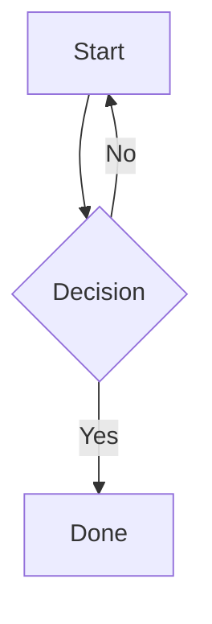

# YFM Quick Reference

For full spec: `05-edit-page/`

This section is an inline quick reference for agents. For the full spec, read `05-edit-page/`.

## Inline Formatting

| Syntax | Result |
|--------|--------|
| `**text**` | Bold |
| `_text_` | Italic |
| `++text++` | Underline |
| `~~text~~` | Strikethrough |
| `==text==` | Highlight |
| `##text##` | Monospace inline |
| `{red}(text)` | Colored text |
| `text^sup^` | Superscript |
| `text~sub~` | Subscript |
| `@login` | User mention |
| `:smile:` | Emoji |

Color values for `{color}(text)`: `gray`, `yellow`, `orange`, `red`, `green`, `blue`, `violet`

## Headings

```markdown
# H1
## H2
## H3
##+ Collapsible H2
## Title {#anchor-id}
```

## Note Blocks

```yfm

Informational content (blue)



Important warning (orange)



Critical alert (red)



Tip or best practice (green)

```

## Cut / Spoiler

```yfm

Hidden content visible only after click

```

Use for: long code blocks, supplementary details, changelogs.

## Tabs

```yfm

- Tab One
    Content for tab one (indent 4 spaces)

- Tab Two
    Content for tab two

```

Use for: multi-environment instructions, before/after comparisons, language variants.

## Multi-Column Layout

```yfm


Left column content


Right column content


```

Layout params: `gap`: `xs`/`s`/`m`/`l`/`xl` | `justify`: `start`/`center`/`end`
Block params: `col`: 1–12 (CSS grid units, total = 12)

## Styled Block (Decorative Border)

```yfm

Content with decorative border

```

`border`: `solid`/`dashed` | `borderColor`: `info`/`tip`/`warning`/`alert`
`borderSize`: `xs`(1px)/`s`(2px)/`m`(4px)/`l`(6px) | `padding`: `xs`(4px)/`s`/`m`/`l`/`xl`(20px)

## Tables

**Standard Markdown table:**

```markdown
| Header 1 | Header 2 | Header 3 |
| :---     | :---:    | ---:     |
| Left     | Center   | Right    |
```

**Multi-line YFM table (supports complex cell content):**

```yfm
#|
|| **Header 1** | **Header 2** ||
|| Cell with **bold** | Cell with `code` ||
|| Multi-word cell | Another cell ||
```

Use YFM tables when cells contain formatting, links, or multiple lines.

## Code Blocks

````markdown
```python
code here
```

```python showLineNumbers
line-numbered code
```
````

## Formulas (KaTeX / LaTeX)

- Inline: `$E = mc^2$`
- Block: `$$\sum_{i=1}^{n} x_i$$`

## Diagrams

**Mermaid:**

````markdown

````

**PlantUML:**

```yfm

@startuml
Bob->Alice: Hello
Alice-->Bob: Hi!
@enduml

```

## Checkboxes (Task Lists)

```markdown
- [ ] Unchecked task

- [x] Checked task
```

Blank line required between checkbox items.

## Dynamic Tables (Grids)

```yfm

```

With options:

```yfm

```

## Include (Shared Content)

```yfm
{{include page="data/shared/team-contacts"}}
```

See `rules/03-include-usage.md` for full Include conventions and when to use it.

## iFrame Embeds

```yfm
/iframe/(src="https://datalens.yandex.ru/..." width="800" height="600" frameborder="0")
```

Allowed domains: YouTube, Vimeo, RuTube, Yandex services, DataLens, draw.io

## Links

YFM supports four explicit link forms plus auto-magic Tracker keys:

```markdown
[Text](https://example.com)                      ← absolute URL
[Text](https://wiki.yandex.ru/data/domains/parcels)  ← absolute wiki URL (use for cross-page links)
[Text](https://wiki.yandex.ru/data/domains/parcels#section-1)  ← URL with anchor
[Text](mailto:user@example.com)
DATAENGINEERING-123                              ← auto magic link to Tracker issue
```

Wiki-relative slug links (URL starts with `/`) and same-page anchor links (URL starts with `#`) are also supported, but prefer absolute URLs for portability across wiki migrations.

## Horizontal Divider

```markdown
---
```

## Hidden Comments (editor-only, not rendered)

```markdown
[//]: # (This comment is invisible in the rendered page)
```

Requires blank line before.

## Escape Special Characters

Use `\` before markdown symbols: `\*`, `\#`, `\^`, `\\`, etc.
