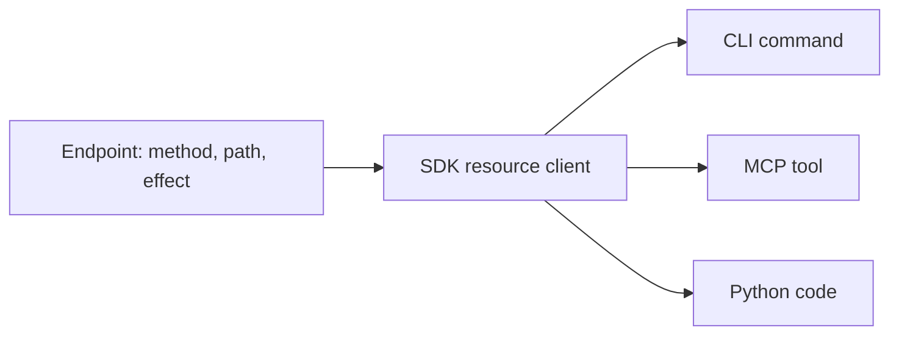

# Устройство

## Одна операция — четыре способа работы

Каждая операция Яндекса, которую оборачивает ycli, объявлена один раз — как `Endpoint`: её метод, путь,
тело, тип ответа и то, что она делает на сервере. SDK отправляет её; команда CLI и MCP-инструмент
вызывают SDK, поэтому способы работы не могут разойтись в описании операции. У команды CLI и
MCP-инструмента одно имя: `ycli tracker boards update` — это инструмент `tracker_boards_update`, и оба
вызывают `tracker.boards.edit`. Имя, выученное на одном способе, работает и на другом.

## Честные эффекты

Хост агента по подсказкам инструмента решает, выполнять ли вызов без подтверждения. В MCP инструмент без
подсказок по умолчанию считается «разрушающим», а подсказка «чтение» на удалении хуже, чем её отсутствие.
В ycli эффект — часть эндпоинта (`read`, `write`, `idempotent_write`, `destructive`), а контрактный
тест запускает каждый инструмент и сравнивает его подсказки с самым сильным эффектом из запросов,
которые он реально отправил. `--read-only` скрывает все инструменты, которые что-то записывают.

## Имена полей самого API

В выводе сохраняются имена полей каждого API: `createdAt` в Трекере, `created_at` в Вики. Ключ
выглядит одинаково в документации Яндекса, в `--format json` и в результате инструмента, поэтому фильтр,
скопированный из документации, работает. В Python-коде атрибуты читаются в snake_case
(`issue.created_at`).

## Типы на границах

Ввод от человека или агента на границе становится типизированной моделью: тело MCP-записи — это
pydantic-модель, поэтому некорректное значение приводит к ошибке до отправки запроса, а в сообщении
называется поле. Ответ не из 2xx в одном месте превращается в типизированную ошибку, а CLI сопоставляет
каждому виду свой [код возврата](../reference/configuration.md#exit-codes).

## Правила проверяются

Структура и эти правила — инварианты с исполняемыми проверками: паритет способов работы, слои импортов,
честные эффекты, единый путь вывода, единые источники истины, версионируемая публичная поверхность,
внедрение зависимостей и типизированные границы. Они перечислены вместе с проверками в
[ARCHITECTURE.md](https://github.com/bim-ba/ycli/blob/main/ARCHITECTURE.md).
