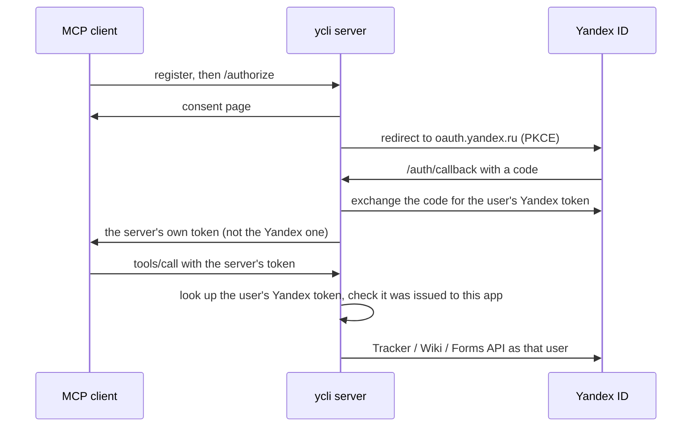

# Свой MCP-сервер по HTTP

Веб-клиентам (claude.ai, ChatGPT) и командам нужен MCP-сервер по HTTPS-адресу, а не локальный процесс.
`ycli mcp start --transport http` поднимает его именно так. Каждый MCP-клиент входит от имени своего
пользователя через Яндекс ID, и каждый вызов инструмента выполняется с собственным токеном Яндекса этого
пользователя, поэтому у каждого остаются его права в Трекере, Вики и Формах.

Публичного экземпляра ycli нет: вы запускаете свой, со своим OAuth-приложением Яндекса.

## Как устроен вход

Спецификация авторизации MCP запрещает серверу передавать токен клиента другому API, а Яндекс ID не
умеет регистрировать MCP-клиентов на лету. Поэтому сервер сам выступает OAuth-клиентом Яндекса
(`OAuthProxy` из fastmcp):



Клиент всегда держит только токен сервера. Сервер принимает токен Яндекса, только если Яндекс ID
подтверждает, что он выдан OAuth-приложению самого сервера.

## 1. Зарегистрируйте OAuth-приложение Яндекса

На [oauth.yandex.ru](https://oauth.yandex.ru) создайте приложение для **авторизации пользователей
(веб-сервисы)**, а не «для доступа к API» (у такого типа фиксированный redirect URI):

| Поле | Значение |
|---|---|
| Redirect URI | `<base_url>/auth/callback`, например `https://mcp.example.com/auth/callback` |
| Права | Трекер, Вики и Формы, чтение и запись — по необходимости (Яндекс разрешает не больше трёх групп прав на приложение) |

Запишите client id и client secret.

## 2. Настройка

| Переменная | Обязательна | Значение |
|---|---|---|
| `YCLI__MCP__BASE_URL` | да | публичный HTTPS-адрес, по которому обращаются клиенты, например `https://mcp.example.com` |
| `YANDEX_ID_ORGANIZATION_ID` | да | организация, в которой работают все пользователи |
| `YANDEX_OAUTH_CLIENT_ID`, `YANDEX_OAUTH_CLIENT_SECRET` | да | приложение из шага 1 |
| `YCLI__MCP__JWT_SIGNING_KEY` | рекомендуется | ключ, которым подписываются токены сервера; если не задан, выводится из client secret, поэтому смена секрета разлогинивает всех |
| `YCLI__MCP__HOST`, `YCLI__MCP__PORT` | нет | где процесс слушает соединения (по умолчанию `127.0.0.1:8000`); `--host` / `--port` их переопределяют |
| `YCLI__MCP__TOKEN_CACHE_SECONDS` | нет | как долго проверенному токену Яндекса доверяют, прежде чем снова спросить Яндекс ID (по умолчанию 300); отозванный токен проработает не дольше этого срока |
| `FASTMCP_HOME` | нет | где в зашифрованном виде хранятся регистрации клиентов и токены (по умолчанию каталог пользовательских данных; в образе Docker — `/data`); держите его на томе |

`YANDEX_ID_OAUTH_TOKEN` по HTTP не используется: вызов без вошедшего пользователя отклоняется, а не
выполняется с токеном из окружения.

## 3. Запуск

В Docker (точка входа образа — `ycli`):

```bash
docker run -d --name ycli-mcp -p 127.0.0.1:8000:8000 \
  -e YCLI__MCP__BASE_URL -e YANDEX_ID_ORGANIZATION_ID \
  -e YANDEX_OAUTH_CLIENT_ID -e YANDEX_OAUTH_CLIENT_SECRET -e YCLI__MCP__JWT_SIGNING_KEY \
  -v ycli-mcp:/data \
  ghcr.io/bim-ba/ycli mcp start --transport http --host 0.0.0.0 --toolsets core
```

Или напрямую: `uvx --from 'yandex-cli[mcp]' ycli mcp start --transport http`. Флаги выбора наборов
инструментов (`--toolsets`, `--read-only`, …; см. [Запуск MCP-сервера](serve-the-mcp-server.md))
действуют так же, как по stdio.

## 4. Поставьте HTTPS перед сервером

Сервер говорит по обычному HTTP и ждёт TLS-прокси по адресу `YCLI__MCP__BASE_URL`. С Caddy:

```text
mcp.example.com {
    reverse_proxy 127.0.0.1:8000
}
```

### Оба шага через Docker Compose

Шаги 3 и 4 одним файлом: ycli и Caddy, который сам получает сертификат для вашего домена. Положите рядом файл `.env` с `MCP_DOMAIN` (имя хоста, например `mcp.example.com`) и переменными из шага 2, затем выполните `docker compose up -d`.

```yaml title="compose.yaml"
--8<-- "docs/examples/compose.yaml"
```

*Проверено 2026-10-03: `docker compose config` принимает файл, сервис `ycli` запускается и отдаёт метаданные входа; Caddy не запускался — ему нужен настоящий домен.*

## 5. Подключите клиентов

| Клиент | Как |
|---|---|
| claude.ai / Claude Desktop | Settings → Connectors → Add custom connector → `https://mcp.example.com/mcp` |
| ChatGPT | режим разработчика → добавить коннектор с `https://mcp.example.com/mcp` |
| Claude Code | `claude mcp add --transport http yandex-360 https://mcp.example.com/mcp` |
| VS Code, Cursor | запись сервера типа `http` с тем же URL |

Клиент открывает страницу входа, показывает экран согласия, затем Яндекс ID.

## Ограничения

- Одна организация на сервер. Запускайте по серверу на каждую организацию.
- Одна реплика: регистрации клиентов лежат в `FASTMCP_HOME`. Для нескольких реплик нужно общее
  хранилище, которое ycli пока не настраивает.
- Запросы не хранят состояния, поэтому перезапуски не сбрасывают сессии; вошедшие пользователи остаются
  вошедшими, пока сохраняются `FASTMCP_HOME` и ключ подписи.
