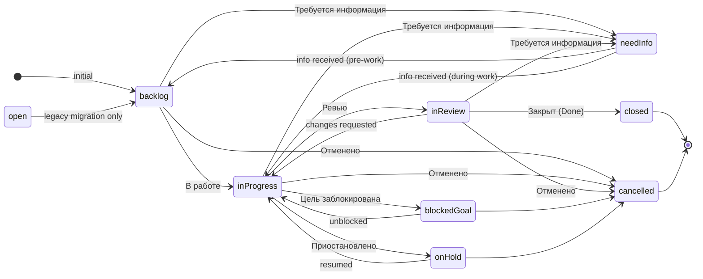

# Rule: Workflow

This is generic Yandex Tracker workflow knowledge. The exact status keys, display
names, and transition IDs depend on how each queue's workflow is configured in the
Tracker admin UI — always discover the live values for your queue (see below) rather
than hardcoding. The tables here describe the **Primary** workflow that Yandex ships
as the default for software-development queues.

## Two Workflows — Primary vs Quick Start

| Workflow | Issue types | Initial status | Notes |
|----------|------------|----------------|-------|
| **Primary** | `epic`, `story`, `improvement`, `refactoring`, `newFeature`, `bug`, `incident` | `backlog` (Беклог) | Default for dev queues; full backlog → review → done lifecycle |
| **Quick Start** (legacy) | `task`, `milestone`, `release` | `open` (Открыт) | Simpler lifecycle; lands issues in `open`, not `backlog` |

**Watch out:** type `task` belongs to the Quick Start workflow. Creating an issue
with type `task` in a Primary-workflow queue lands it in `open` status and bypasses
the Primary lifecycle. If you want a generic work item under the Primary workflow,
use `improvement` (or `refactoring` / `newFeature`) instead. Discover the types your
queue actually accepts with `uv run ycli tracker issuetypes list`.

## Primary Workflow Issue Types

| Type key | Display | Typical use |
|----------|---------|-------------|
| `epic` | Epic | Business capability spanning weeks–months; groups multiple stories |
| `story` | Story | Single user-facing deliverable with a testable outcome |
| `improvement` | Improvement / Улучшение | Enhancement to existing functionality |
| `refactoring` | Refactoring / Рефакторинг | Code/structure cleanup, no behavior change |
| `newFeature` | New Feature / Новая возможность | Brand-new capability |
| `bug` | Bug / Ошибка | Production defect |
| `incident` | Incident / Инцидент | Production crisis; resolved fast, standalone |

## Status Lifecycle (typical Primary configuration)

**Main path:** `backlog` → `inProgress` → `inReview` → `closed`

**Blocked on missing information → `needInfo`, not left in `backlog`.** If you can't
proceed because you need an answer from someone, transition the issue to `needInfo`
and list the specific questions in a comment — don't park it in `backlog` (which
reads as "ready to start"). On reply: `needInfo → backlog` (info received, pre-work)
or `needInfo → inProgress` (info received, mid-work).

## Status Keys, Display Names, and Types

| Key | EN display | RU display | Type | Meaning |
|-----|-----------|-----------|------|---------|
| `backlog` | Backlog | Беклог | new | Initial: triaged, not yet started |
| `inProgress` | In Progress | В работе | inProgress | Assignee actively working |
| `inReview` | In Review | Ревью | paused | Submitted for review (PR or stakeholder) |
| `closed` | Closed | Закрыт | done | Completed; resolution required |
| `cancelled` | Cancelled | Отменено | cancelled | Will not be completed |
| `needInfo` | Need Info | Требуется информация | paused | Waiting for clarification |
| `blockedGoal` | Blocked goal | Цель заблокирована | paused | External blocker; unblock date useful |
| `onHold` | On Hold | Приостановлено | paused | Deliberately paused; restart condition useful |
| `open` | Open | Открыт | new | Quick Start / legacy migration only |

Use the `key` value when querying or filtering via the API. Use the `display` value
when writing user-facing text or comments. These exact keys/displays come from a
typical Primary configuration — your queue may differ.

## Transition IDs — always discover, never hardcode

Yandex Tracker assigns suffixed transition IDs when the same target status is
reachable from multiple source statuses (e.g. `cancelled`, `cancelled1`,
`cancelled2`). The available transitions depend on the issue's **current** status.

Always run `uv run ycli tracker transitions list <KEY>` immediately before
`transitions execute` and use the IDs it returns. Executing a transition that is not
in the available list returns 400.

## Required Fields and Artifacts per Transition

Each Tracker workflow can mark fields as required for a given transition. The common
Primary-workflow expectations:

| Transition | Typically required / recommended at execute time |
|-----------|---------------------------------------------------|
| `backlog` → `inProgress` | Set `assignee` (and often a due/end date); note who is starting and why |
| `inProgress` → `inReview` | — |
| `inReview` → `closed` | `resolution` field (mandatory); a done-summary comment |
| Any → `blockedGoal` | Comment with the blocker and expected unblock date |
| Any → `onHold` | Comment with the restart condition or date |
| Any → `cancelled` | Comment with the reason |
| Any → `needInfo` | Comment listing the specific open questions |

If a transition rejects with a "field required" error, run
`uv run ycli tracker transitions list <KEY>` — the response describes the fields each
transition expects — then re-run `execute` with those fields via `-F`.

## Resolution Values

When transitioning to `closed` (Done), a `resolution` is required. Allowed values per
type in a typical Primary configuration:

| Type | Allowed resolutions |
|------|---------------------|
| `epic`, `story`, `improvement`, `refactoring`, `newFeature` | `successful`, `fixed`, `dontDo` |
| `bug`, `incident` | `fixed`, `cantReproduce` |

| Resolution key | EN | RU | When |
|----------------|----|----|------|
| `successful` | Successful | Успешно | Feature/improvement completed as planned |
| `fixed` | Fixed | Решен | Bug, incident, or work item resolved |
| `dontDo` | Don't do | Не делаем | Deprioritized; deliberately not done |
| `cantReproduce` | Can't reproduce | Не воспроизводится | Bug could not be reproduced |

Pass it through the `-F` hatch:
`uv run ycli tracker transitions execute KEY closed -F 'resolution={"key":"fixed"}'`.

## Closing Rules

- **Close all children before closing a Story or Epic** — `cancelled` or `closed` all
  child issues first; the API does not enforce this.
- **`open` is a backward escape hatch** — most statuses can transition back to `open`
  (often a transition like `openMeta`); use only when an issue needs to revert to a
  pre-Backlog state (rare; usually migration cleanup).
- **Workflow structure** (statuses, transitions, required fields) is configured in the
  Tracker admin UI only — the API cannot create or modify it.
