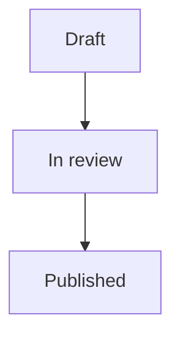

# YFM Quick Reference

Yandex Flavored Markdown (YFM) is CommonMark plus a set of block/inline extensions.
This is an original cheatsheet of the elements you reach for when authoring Wiki pages
through `ycli wiki pages create|update`. For the full, current syntax see the live docs
at <https://yandex.ru/support/wiki/> (Wiki) and the open-source YFM spec at
<https://ydocs.tech/>.

Author page bodies starting at the `# H1` — do **not** ship YAML frontmatter (the CLI
does not strip it; see the skill's Writing section).

## Notes (admonitions)

Four severities. The block is fenced by `` … ``; the type sets
the colour/icon.

```

General context or a tip.



Something the reader must not miss.



Danger — data loss / irreversible action.



Optional best-practice suggestion.

```

## Cuts (collapsible spoilers)

Hide long or secondary content behind a click. The text after `cut` is the visible
summary line.

```


Hidden body — any block content (lists, code, tables) is allowed here.


```

## Tabs

Group alternative content (per-language, per-OS, …) into a tab set.

```


- macOS / Linux

  Content for the first tab.

- Windows

  Content for the second tab.


```

## Multi-column layout

Place blocks side by side.

```

```

Prefer the dedicated layout element when the space is available; otherwise a two-column
table is a pragmatic fallback. Keep columns short — they stack on narrow viewports.

## Tables

Standard Markdown pipe tables work. Alignment is set by the colon in the header rule.

```
| Field   | Type   | Notes            |
|:--------|:------:|-----------------:|
| id      | int    | server-assigned  |
| slug    | string | permanent        |
```

For editable spreadsheet-style data use a Wiki **grid** (`ycli wiki grids …`), not a
Markdown table — grids are first-class objects with typed columns.

## Code

Inline: `` `code` ``. Fenced blocks take a language hint for highlighting:

````
```python
client.pages.get("team/overview")
```
````

## Diagrams (Mermaid)

Fenced block with the `mermaid` language tag:

````

````

Supported diagram kinds mirror upstream Mermaid (flowchart, sequence, gantt, …).

## Anchors and links

- Internal Wiki link: `[label](/space/page-slug)` (leading `/` = org-absolute).
- Custom heading anchor: append `{#my-anchor}` to a heading, then link `[…](#my-anchor)`.
- Tracker magic link: type a bare issue key (`QUEUE-123`) in the body — it auto-renders
  as a live Tracker card. No special syntax; see the skill's cross-linking section.

## Includes (DRY shared content)

Pull a fragment from another page/file so it is authored once:

```

```

See `rules/03-include-usage.md` for when includes help versus when they hurt
readability.

## Images and files

```

```

Attach binaries with `ycli wiki attachments attach <page_id> <file>`, then reference the
returned URL. See the skill's Reading/Writing sections for the id-then-attach flow.
