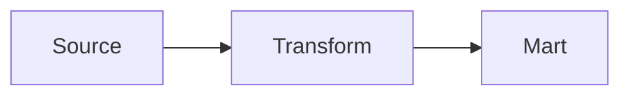

# Rule: Content Standards

## YFM Element Selection Guide

### Note Blocks

Choose the note type based on what the reader needs to do with the information:

- `` — informational context; background that helps the reader understand but does not require action
- `` — gotchas and data quality caveats; the reader should keep this in mind before proceeding
- `` — critical warnings: data loss risk, breaking changes, irreversible actions
- `` — best practices; optional but recommended approaches

Examples:

```text

Background context that helps the reader understand the page.



A gotcha to keep in mind before proceeding.



An irreversible or destructive action the reader must not overlook.



An optional but recommended approach.

```

### Cut / Spoiler

Use `` for content that is supplementary and not needed for most readers:

- Long code blocks (more than ~20 lines)
- Supplementary details or explanations
- Changelogs and version history
- Full error output for reference

````text

```sql
SELECT ...
```

````

### Tabs

Use `` only when content represents **genuinely alternative paths** — the reader will follow one tab, not all of them:

- Multi-environment instructions (prod vs staging vs local)
- Before/after comparisons
- Language or tool variants (Python vs SQL)

```text

- Production
    Connect to `service-prod.internal:9000`

- Staging
    Connect to `service-stage.internal:9000`

```

### Multi-Column Layout

Use `` for side-by-side comparisons and dual-column layouts where reading both sides together adds value:

- Before/after code comparisons
- Two related lists shown together
- Dual-column reference tables

```text


**Before**
Old approach here


**After**
New approach here


```

---

## When NOT to Use YFM Blocks

These rules prevent visual noise and overuse:

- **Do not use note blocks for every paragraph** — reserve them for genuinely important callouts. If a page has more than 3–4 note blocks, reconsider which ones are truly necessary.
- **Do not nest cut blocks more than one level deep** — a cut inside a cut is hard to navigate and suggests the content structure needs rethinking.
- **Do not use tabs for content that flows logically** — if the reader needs to understand all sections in sequence, use headings, not tabs. Tabs are for content where the reader picks one branch.
- **Do not use layout columns for standard prose** — column layout is for structured comparisons only, not for making a page look dense.

---

## Diagrams

- **Use Mermaid** for all new diagrams
- PlantUML: only if it already exists on older pages — do not create new PlantUML diagrams
- Data flow diagrams: use `flowchart LR` (left to right)
- Lifecycle and state diagrams: use `stateDiagram-v2`



---

## Tables

Use tables for structured data, not bullet lists with parallel structure. If your list has 3+ items that each have a name and a description, use a table.

**Markdown table (standard):**

```markdown
| Column 1 | Column 2 | Column 3 |
| :---     | :---:    | ---:     |
| Left     | Center   | Right    |
```

**YFM multi-line table** — use when cells contain formatting, code, or links:

```text
#|
|| **Column 1** | **Column 2** ||
|| Cell with `code` | [Link text](https://example.com) ||
```

---

## Code Blocks

Always specify the language for syntax highlighting:

````text
```sql
SELECT count() FROM your_table WHERE created_at >= today()
```

```python
import json, sys
d = json.load(sys.stdin)
print(d.get('content', ''))
```
````

For long code blocks (more than ~20 lines), wrap in a ``.

---

## Do Not Duplicate Content

- Link to source code, docs, or configuration in its repository instead of copying it into a page.
- A link that can go stale is better than a stale copy embedded in a page.
